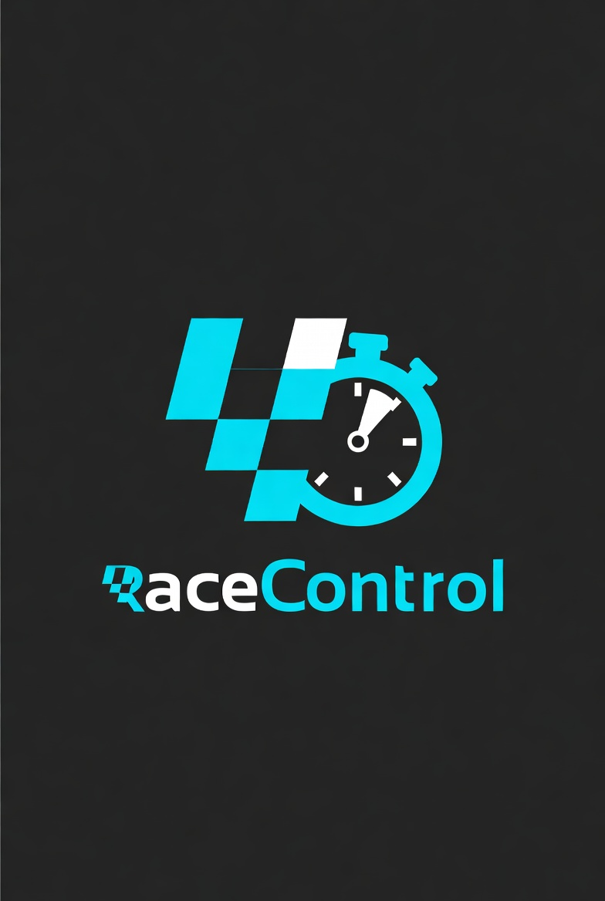

<div align="center">
  

  # RaceControl Pro

  **Professionelle Kart-Slalom Veranstaltungssoftware**

  
  
  
  
  [](https://www.paypal.com/paypalme/AnkeHolzhauer)

  *Entwickelt für den ADAC Kart-Slalom des **MSC Braach e.V. im ADAC** (Hessen-Thüringen)*
</div>

---

## Was ist RaceControl Pro?

RaceControl Pro ist eine **vollständige Veranstaltungssoftware** für ADAC Kart-Slalom-Events –
von der Online-Voranmeldung am Morgen bis zur offiziellen Ergebnisliste am Abend.

Das System läuft komplett **lokal auf einem Laptop**, braucht kein Internet und ist für alle Geräte auf dem Veranstaltungsgelände per WLAN erreichbar. Tablets am Nennbüro, Smartphones der Zuschauer, Raspberry Pi an der Lichtschranke – alles verbindet sich mit einem einzigen Prozess.

---

## Features auf einen Blick

| Modul | Was es kann |
|---|---|
| **Landingpage** | Veranstaltungsinfos, Live-Klassenstatus, Zwischenwertung, Sponsoren |
| **Online-Nennung** | Selbstanmeldung per Tablet/Smartphone ohne Login, Duplikatcheck |
| **Nennbüro** | Teilnehmerverwaltung, Abnahme (Nenngeld + Helm), Startnummernvergabe (pro Klasse ab 1, Auto-Nummerierung), Drucken; Sortierung nach Status → Klasse → Jahrgang |
| **Zeitnahme** | Zeiteingabe, Strafbuchung per Tastatur, DNS/DNF/DSQ, Fahrer vorziehen, Undo, automatische Lauf-Erkennung |
| **Schiedsrichter** | Klassenstatus steuern, Einspruchfrist-Timer, Ergebnisse + Strafen korrigieren |
| **Training** | Trainingsmodus fuer Jugendliche: Sessions verwalten, Zeiten erfassen (Lichtschranke auto-befuellt), Wertung, Straf-Schnelltasten |
| **Livetiming** | Echtzeit-Ergebnisse für Zuschauer – Gesamtrang + Lauf-Detailzeilen, Trainingszeiten als Fallback |
| **Auswertung** | Statistikseite pro Veranstaltung: Schnellster Wertungslauf je Klasse, Schnellste Dame, Schnellster Herr |
| **Sprecher** | 3-spaltiges Dashboard: aktueller Fahrer, Zeitanalyse (Was braucht er für P1/P3/P10?, Pylonen-Budget), Ereignis-Log (Streckenposten-Meldungen, Klassenänderungen, Ankündigungen) |
| **Lichtschranke** | Raspberry Pi Client (TM1637 oder MAX7219 Display), ELV LSU200 per USB (Windows), ALGE Timy2/3 per RS232 (Windows) |
| **Nachrichten** | Push-Nachrichten an alle Clients senden (Ankündigungen, Infos) |
| **Streckenposten** | Eigene Rolle `marshal`; Fehlerpunkte per Eingabefeld sofort an Zeitnahme + Sprecher melden |
| **Dokumente** | Öffentliche Seite für Reglemente, Vorlagen & Formulare aus dem `assets/`-Ordner |
| **Drucken & Export** | ADAC-Ergebnisliste, Sprecherliste, Nennformular, Urkunden |
| **PWA** | Offline-fähig, installierbar auf Smartphone-Homescreen |

---

## Screenshots

<div align="center">
  
  
  
</div>

---

## Architektur

```
RaceControl/
├── backend/                    # Python / FastAPI + SQLite (WAL)
│   ├── main.py                 # App-Einstieg, CORS, WebSocket-Endpunkte, Static-Files
│   ├── database.py             # Schema-Init + automatische Migrationen (ALTER TABLE)
│   ├── schemas.py              # Pydantic-Modelle (Request / Response)
│   ├── deps.py                 # JWT-Auth, Rollen-Guard
│   ├── auth.py                 # Passwort-Hashing (bcrypt)
│   ├── broadcast.py            # WebSocket-BroadcastManager (Push an alle Clients)
│   ├── system_logger.py        # Thread-sicheres System-Log (Login, Server-Start)
│   ├── seed.py                 # Testdaten-Seeder (Admin-Tab)
│   └── routers/                # API-Endpunkte pro Modul
│       ├── auth.py             # POST /login
│       ├── users.py            # Benutzerverwaltung
│       ├── events.py           # Veranstaltungen + Klassen
│       ├── participants.py     # Teilnehmer, Abnahme, Startnummern
│       ├── results.py          # Zeiteingabe, Strafen, Statistik
│       ├── reglements.py       # Reglements + PenaltyDefinitions
│       ├── clubs.py            # Vereinsstammdaten
│       ├── teams.py            # Mannschaftswertung
│       ├── sponsors.py         # Sponsoren
│       ├── public.py           # Öffentliche API (Livetiming, Online-Nennung)
│       ├── marshal.py          # Streckenposten-Meldungen
│       ├── notifications.py    # Push-Nachrichten
│       ├── settings.py         # Systemeinstellungen (Druckvorlagen)
│       ├── assets.py           # Dokumente-Verzeichnis
│       ├── admin_logs.py       # Audit-Log, Marshal-Reports, System-Log
│       ├── trainees.py         # Jugendlichen-Datenbank (Training)
│       ├── training.py         # Training-Sessions + Läufe
│       └── import_router.py    # Datenimport
│
├── frontend/                   # Vue 3 + Vite + Tailwind CSS
│   └── src/
│       ├── views/              # Rollenspezifische Ansichten (15 Views)
│       │   ├── AdminView.vue           # Vollzugriff (7 Tabs)
│       │   ├── ZeitnahmeView.vue       # Tastatur-optimierte Zeiteingabe
│       │   ├── NennungView.vue         # Nennbüro, Abnahme, Drucken
│       │   ├── SchiedsrichterView.vue  # Klassensteuerung, Korrekturen
│       │   ├── TrainingView.vue        # Trainingsmodus (3-spaltig)
│       │   ├── AuswertungView.vue      # Statistik: Bestzeiten, Dame, Herr
│       │   ├── SpeakerView.vue         # Sprecher-Dashboard (3-spaltig)
│       │   ├── LivetimingView.vue      # Öffentliches Livetiming (PWA)
│       │   ├── MarshalView.vue         # Streckenposten (Mobile)
│       │   ├── NachrichtenView.vue     # Push-Nachrichten
│       │   ├── DokumenteView.vue       # Öffentliche Dokumente
│       │   ├── SelbstnennungView.vue   # Online-Nennung (kein Login)
│       │   ├── GasteView.vue           # Landingpage (kein Login)
│       │   ├── LizenzView.vue          # GPL-Lizenzseite
│       │   └── LoginView.vue
│       ├── components/
│       │   ├── AppHeader.vue           # TopBar mit Live-Uhr + Mehr-Dropdown
│       │   └── StatusBar.vue           # GPL-Link, Verbindungsstatus
│       ├── composables/
│       │   ├── useNetworkStatus.js     # Offline-Erkennung + Amber-Banner
│       │   └── useRealtimeUpdate.js    # WebSocket-Verbindung + Reconnect
│       ├── stores/
│       │   ├── auth.js                 # Pinia: JWT, Rolle, Login/Logout
│       │   └── event.js                # Pinia: aktive Veranstaltung
│       ├── router/index.js             # Vue Router mit Rollen-Guard
│       └── api/client.js              # Axios-Instanz + Auth-Header
│
├── RaPi_lichtschranke/         # Raspberry Pi Lichtschranken-Clients
│   ├── racecontrol_client.py           # Produktions-Client (TM1637-Display)
│   ├── racecontrol_client_max7219.py   # Produktions-Client (MAX7219-LED-Matrix)
│   ├── py_code_raspi_TM1637.py         # Standalone-Test TM1637
│   ├── py_code_raspi_max7219.py        # Standalone-Test MAX7219
│   └── notes.md                        # Hardware-Aufbau und Verkabelung
│
├── tools/                      # Externe Geräte-Clients (laufen auf dem Laptop)
│   ├── lsu200_client.py                # ELV LSU200 USB-Lichtschranke (COM-Port)
│   ├── alge_timy_client.py             # ALGE Timy RS232-Lichtschranke (COM-Port)
│   ├── alge_multi_timy_client.py       # ALGE Multi-Timy (mehrere Geräte gleichzeitig)
│   └── requirements.txt
│
├── Windows/                    # Windows-Installer-Paket
│   ├── launcher.py             # Einstiegspunkt: Server + Browser + Tray-Icon
│   ├── racecontrol.spec        # PyInstaller-Konfiguration (onedir-Build)
│   ├── installer.iss           # Inno Setup 6 (kein Admin erforderlich)
│   ├── build.ps1               # Vollautomatischer Build-Ablauf
│   └── README_BUILD.md         # Build-Anleitung
│
├── schema.sql                  # SQLite-Schema (Single Source of Truth)
├── Dockerfile                  # Multi-Stage-Build (Node → dist, Python → FastAPI)
├── docker-compose.yml          # Start mit einem Befehl inkl. Volumes
├── assets/                     # Dokumente, Reglements-PDFs (persistentes Volume)
└── data/                       # SQLite-DB (persistentes Volume, lokal leer)
```

**Backend:** Python 3.12, FastAPI, SQLite (WAL), JWT (HS256), bcrypt, WebSockets, pytest (105 Tests)  
**Frontend:** Vue 3 (Composition API), Vite, Pinia, Vue Router, Tailwind CSS, Axios, Vitest  
**Deployment:** Docker (Single-Container), Windows-Installer (PyInstaller + Inno Setup)

---

## Projektkennzahlen

| Kategorie | Dateien | Zeilen |
|-----------|---------|--------|
| Python – Backend, Tests, Tools | 44 | ~5.900 |
| Vue / JavaScript – Frontend | 31 | ~7.800 |
| SQL, Konfiguration, Spec | 3 | ~500 |
| **Quellcode gesamt** | **78** | **~14.200** |
| Dokumentation (Handbücher, Changelog) | 13 | ~2.000 |

Geschätzter Entwicklungsaufwand: **~205 Stunden** · Marktwert als Freelancer-Projekt: **~18.000–20.000 €**

---

## Schnellstart (Docker – empfohlen)

Der einfachste Weg zum Betrieb – kein Python, kein Node.js nötig.

```bash
# Image bauen & starten
docker compose up --build

# Im Hintergrund starten
docker compose up -d --build
```

Läuft auf `http://localhost:1980`. Daten bleiben in `data/` und `assets/` erhalten.

Optional: `SECRET_KEY` in einer `.env`-Datei setzen:
```
SECRET_KEY=mein-geheimes-passwort
```

---

## Schnellstart (Entwicklung)


### Voraussetzungen

- Python 3.9+ und Node.js 18+

### Backend

```bash
cd backend
pip install fastapi uvicorn pyjwt bcrypt
uvicorn main:app --reload --host 0.0.0.0 --port 1980
```

Die Datenbank (`racecontrol.db`) wird beim ersten Start automatisch aus `schema.sql` angelegt.

### Frontend

```bash
cd frontend
npm install
npm run dev
```

Läuft auf `http://localhost:5173`, proxyt API-Aufrufe an Port 1980.

---

## Veranstaltungstag-Deployment

Am Veranstaltungstag läuft **nur ein einziger Prozess** – kein Node.js erforderlich.

```bash
# Einmalig vorbereiten
cd frontend && npm run build        # erzeugt frontend/dist/

# Am Veranstaltungstag
cd backend
uvicorn main:app --host 0.0.0.0 --port 1980
```

FastAPI liefert das gebaute Frontend automatisch mit aus. Alle Geräte im WLAN erreichen die App unter `http://<Laptop-IP>:1980` (IP per `ipconfig` ermitteln).

---

## Rollen & Zugänge

| Rolle | URL | Zugang |
|---|---|---|
| Gäste | `/` `/livetiming` `/nennen` | ohne Login |
| `nennung` | `/nennung` | Nennbüro, Abnahme, Drucken |
| `zeitnahme` | `/zeitnahme` `/training` | Zeiteingabe, Strafen |
| `marshal` | `/marshal` | Streckenposten – Fehlerpunkte melden |
| alle angemeldeten Rollen | `/nachrichten` | Push-Nachrichten senden & empfangen |
| `schiedsrichter` | `/schiedsrichter` | Klassensteuerung, Korrekturen |
| `viewer` | `/livetiming` `/sprecher` `/nachrichten` | Livetiming, Sprecher-Dashboard, Nachrichten |
| `admin` | `/admin` | Vollzugriff |
| Gäste | `/dokumente` | Reglemente & Vorlagen herunterladen |

Erster Login: `admin` / *(Passwort beim ersten Start über `/docs` setzen)*

---

## Tests

```bash
# Backend
cd backend && pytest

# Frontend
cd frontend && npm run test
```

CI/CD läuft automatisch bei Push/PR via GitHub Actions (Python 3.11 + Node 20).

---

## Dokumentation

| Dokument | Inhalt |
|---|---|
| [HANDBUCH.md](HANDBUCH.md) | Bedienungsanleitung für alle Rollen |
| [DEV_HANDBOOK.md](DEV_HANDBOOK.md) | Entwickler-Handbuch: Architektur, Tests, neue Features |
| [FEATURES.md](FEATURES.md) | Vollständige Funktionsübersicht |
| [LICHTSCHRANKE_SETUP.md](LICHTSCHRANKE_SETUP.md) | Setup-Handbuch für alle Lichtschranken-Varianten (LSU200, ALGE Timy, Raspberry Pi) |
| [db_design.md](db_design.md) | Datenbankschema und API-Architektur |
| [changelog.txt](changelog.txt) | Versionshistorie |

---

## Spenden

RaceControl Pro ist kostenlos und Open Source – entwickelt in der Freizeit speziell für den  
Kart-Slalom der **Jugend-Gruppe des MSC Braach e.V. im ADAC**.

Wenn dir die Software bei deiner Veranstaltung hilft und du die Weiterentwicklung sowie  
die Jugendarbeit unterstützen möchtest, freut sich der Entwickler über eine kleine Spende:

[](https://www.paypal.com/paypalme/AnkeHolzhauer)

> **PayPal:** bernd.holzhauer@googlemail.com  
> Vielen Dank! 🏎️

---

## Mitmachen

Du bist im Motorsport zu Hause oder einfach ein starker Entwickler?
Schau dir [FEATURES.md](FEATURES.md) an und leg los – Pull Requests sind herzlich willkommen!

Dieses Projekt ist für den Einsatz im ADAC Kart-Slalom gedacht.
Bei Interesse an einer Nutzung außerhalb des MSC Braach einfach melden.

---

<div align="center">
  Made with ❤️ für den Jugend-Kart-Slalom · MSC Braach e.V. im ADAC
</div>
